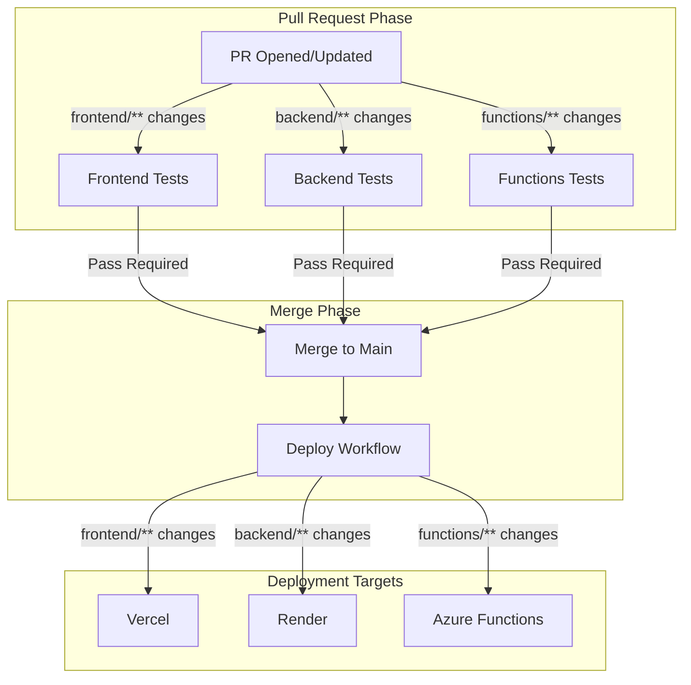

# Design Document: CI/CD Deployment Setup

## Overview

This design describes the CI/CD pipeline architecture for InvestingIQ, a full-stack application with three deployment targets: Vercel (frontend), Render (backend), and Azure Functions (serverless). The pipeline uses GitHub Actions for orchestration, with test workflows running on pull requests and deployment workflows triggering after merge to main.

The architecture follows a "test-then-deploy" pattern where:
1. Pull requests trigger component-specific test workflows
2. Branch protection rules require tests to pass before merge
3. Merges to main trigger deployment workflows for changed components only

## Architecture



## Components and Interfaces

### 1. Backend Test Workflow (`.github/workflows/backend-tests.yml`)

Runs pytest with coverage on backend code changes.

```yaml
# Trigger: PR to main with backend/** changes
# Runtime: ubuntu-latest, Python 3.11
# Steps:
#   1. Checkout code
#   2. Setup Python with pip cache
#   3. Install dependencies
#   4. Run pytest with coverage
#   5. Upload coverage artifact
```

### 2. Unified Deploy Workflow (`.github/workflows/deploy.yml`)

Orchestrates deployment to all three platforms after merge.

```yaml
# Trigger: push to main
# Jobs:
#   1. detect-changes: Determine which components changed
#   2. deploy-frontend: Trigger Vercel (if frontend changed)
#   3. deploy-backend: Trigger Render deploy hook (if backend changed)
#   4. deploy-functions: Deploy to Azure Functions (if functions changed)
```

### 3. Render Configuration (`render.yaml`)

Infrastructure-as-code for Render backend service.

```yaml
# Service: investingiq-backend
# Type: Docker
# Dockerfile: backend/Dockerfile
# Health check: /health
# Environment: Production secrets from Render dashboard
```

### 4. Azure Functions Deployment

Uses Azure CLI with Service Principal authentication via PFX certificate.

```
Authentication Flow:
1. Decode base64 PFX certificate from GitHub secret
2. Login with az login --service-principal using certificate
3. Deploy function app using az functionapp deployment
4. Configure app settings from GitHub secrets
```

## Data Models

### GitHub Secrets Schema

| Secret Name | Description | Used By |
|-------------|-------------|---------|
| `AZURE_CLIENT_ID` | Service Principal Application ID | Azure Functions deployment |
| `AZURE_TENANT_ID` | Azure AD Tenant ID | Azure Functions deployment |
| `AZURE_SUBSCRIPTION_ID` | Azure Subscription ID | Azure Functions deployment |
| `AZURE_SP_CERTIFICATE_BASE64` | Base64-encoded PFX certificate | Azure Functions deployment |
| `AZURE_SP_CERTIFICATE_PASSWORD` | PFX certificate password | Azure Functions deployment |
| `AZURE_FUNCTION_APP_NAME` | Name of the Function App | Azure Functions deployment |
| `AZURE_RESOURCE_GROUP` | Resource Group name | Azure Functions deployment |
| `RENDER_DEPLOY_HOOK_URL` | Render deploy hook URL | Backend deployment |
| `FUNC_DATABASE_URL` | Database connection string | Azure Functions app settings |
| `FUNC_OPENAI_API_KEY` | OpenAI API key | Azure Functions app settings |
| `FUNC_OPENAI_BASE_URL` | OpenAI base URL | Azure Functions app settings |
| `FUNC_LLM_MODEL` | LLM model name | Azure Functions app settings |
| `FUNC_BACKEND_CALLBACK_URL` | Backend callback URL | Azure Functions app settings |
| `FUNC_SERVICEBUS_CONNECTION_STRING` | Service Bus connection | Azure Functions app settings |
| `FUNC_STORAGE_CONNECTION_STRING` | Storage connection | Azure Functions app settings |
| `FUNC_ALPHA_VANTAGE_API_KEYS` | Alpha Vantage API keys | Azure Functions app settings |

### Workflow Outputs

```yaml
detect-changes:
  outputs:
    frontend: 'true' | 'false'
    backend: 'true' | 'false'
    functions: 'true' | 'false'
```

## Correctness Properties

*A property is a characteristic or behavior that should hold true across all valid executions of a system—essentially, a formal statement about what the system should do. Properties serve as the bridge between human-readable specifications and machine-verifiable correctness guarantees.*

This feature is primarily infrastructure configuration (GitHub Actions workflows, render.yaml, documentation) rather than application code with algorithmic properties. The acceptance criteria are verified through:
- Configuration file inspection (YAML syntax and content)
- Manual deployment testing
- Branch protection rule configuration

No property-based tests are applicable for this feature. Verification is done through:
1. YAML linting to ensure valid syntax
2. Manual PR/deployment testing to verify workflow triggers
3. Documentation review to ensure completeness

## Error Handling

### Workflow Failures

| Failure Type | Handling Strategy |
|--------------|-------------------|
| Test failure | Block PR merge via branch protection; display failure in PR checks |
| Azure auth failure | Fail deployment job; log error message with troubleshooting hints |
| Render deploy hook failure | Fail deployment job; retry once before failing |
| Missing secrets | Fail early with clear error message indicating which secret is missing |
| Network timeout | Use GitHub Actions retry mechanism with exponential backoff |

### Azure Functions Deployment Errors

```yaml
# Error handling in deploy workflow
- name: Deploy to Azure Functions
  continue-on-error: false
  run: |
    az functionapp deployment source config-zip \
      --resource-group ${{ secrets.AZURE_RESOURCE_GROUP }} \
      --name ${{ secrets.AZURE_FUNCTION_APP_NAME }} \
      --src functions.zip || {
        echo "::error::Azure Functions deployment failed"
        exit 1
      }
```

## Testing Strategy

### Verification Approach

Since this feature consists of CI/CD configuration files rather than application code, testing follows a different approach:

1. **YAML Validation**: Use `yamllint` or similar tools to validate workflow syntax
2. **Dry Run Testing**: Test workflows on a feature branch before merging
3. **Manual Verification**: Verify deployments succeed after merge to main
4. **Documentation Review**: Ensure all setup steps are documented and accurate

### Pre-Merge Checklist

- [ ] All workflow YAML files pass syntax validation
- [ ] GitHub secrets are configured in repository settings
- [ ] Branch protection rules require status checks
- [ ] Render deploy hook URL is valid
- [ ] Azure Service Principal has correct permissions
- [ ] Vercel GitHub integration is connected

### Post-Merge Verification

- [ ] Test workflows trigger on PR to main
- [ ] Deploy workflow triggers on merge to main
- [ ] Azure Functions deployment succeeds
- [ ] Render deployment succeeds
- [ ] Vercel deployment succeeds
- [ ] All environment variables are correctly set

