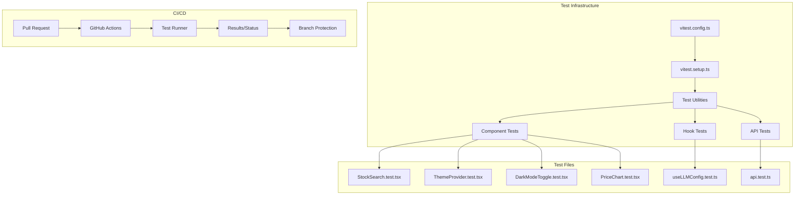

# Design Document: Frontend Testing Setup

## Overview

This design establishes a comprehensive frontend testing infrastructure for the InvestingIQ Next.js application. The solution leverages Vitest as the test runner with React Testing Library for component testing, implements GitHub Actions for CI/CD, and provides documentation for branch protection configuration.

The architecture follows a simple, pragmatic approach:
- Configure Vitest with @vitejs/plugin-react for Next.js compatibility
- Create test utilities for common patterns (mocking, rendering with providers)
- Write focused tests for critical components, hooks, and API client
- Set up GitHub Actions workflow for automated testing on PRs

## Architecture



## Components and Interfaces

### 1. Vitest Configuration (vitest.config.ts)

```typescript
import { defineConfig } from 'vitest/config'
import react from '@vitejs/plugin-react'
import path from 'path'

export default defineConfig({
    plugins: [react()],
    test: {
        environment: 'jsdom',
        globals: true,
        setupFiles: ['./vitest.setup.ts'],
        include: ['src/**/*.{test,spec}.{js,jsx,ts,tsx}'],
        exclude: ['node_modules', '.next'],
        coverage: {
            provider: 'v8',
            include: ['src/**/*.{js,jsx,ts,tsx}'],
            exclude: ['src/**/*.d.ts', 'src/**/layout.tsx'],
        },
    },
    resolve: {
        alias: {
            '@': path.resolve(__dirname, './src'),
        },
    },
})
```

### 2. Vitest Setup (vitest.setup.ts)

```typescript
import '@testing-library/jest-dom/vitest'
import { vi } from 'vitest'

// Mock Next.js router
vi.mock('next/navigation', () => ({
    useRouter: () => ({
        push: vi.fn(),
        replace: vi.fn(),
        prefetch: vi.fn(),
        back: vi.fn(),
    }),
    usePathname: () => '/',
    useSearchParams: () => new URLSearchParams(),
}))

// Mock localStorage
const localStorageMock = {
    getItem: vi.fn(),
    setItem: vi.fn(),
    removeItem: vi.fn(),
    clear: vi.fn(),
}
Object.defineProperty(window, 'localStorage', { value: localStorageMock })

// Mock matchMedia for theme detection
Object.defineProperty(window, 'matchMedia', {
    value: vi.fn().mockImplementation(query => ({
        matches: false,
        media: query,
        onchange: null,
        addListener: vi.fn(),
        removeListener: vi.fn(),
        addEventListener: vi.fn(),
        removeEventListener: vi.fn(),
        dispatchEvent: vi.fn(),
    })),
})
```

### 3. Test Utilities (src/__tests__/utils/test-utils.tsx)

```typescript
import { render, RenderOptions } from '@testing-library/react'
import { ThemeProvider } from '@/components/ThemeProvider'
import { ReactElement } from 'react'

// Custom render that wraps components with providers
function customRender(ui: ReactElement, options?: Omit<RenderOptions, 'wrapper'>) {
    return render(ui, {
        wrapper: ({ children }) => <ThemeProvider>{children}</ThemeProvider>,
        ...options,
    })
}

export * from '@testing-library/react'
export { customRender as render }
```

### 4. Mock Data Factory (src/__tests__/utils/mock-data.ts)

```typescript
import { StockSearchResult, PriceDataPoint } from '@/lib/api'

export function createMockStock(overrides?: Partial<StockSearchResult>): StockSearchResult {
    return {
        ticker: 'AAPL',
        name: 'Apple Inc.',
        exchange: 'NASDAQ',
        ...overrides,
    }
}

export function createMockPriceData(count: number = 5): PriceDataPoint[] {
    return Array.from({ length: count }, (_, i) => ({
        date: `2024-01-${String(i + 1).padStart(2, '0')}`,
        open: 150 + i,
        high: 155 + i,
        low: 148 + i,
        close: 152 + i,
        volume: 1000000 + i * 100000,
    }))
}
```

### 5. GitHub Actions Workflow (.github/workflows/frontend-tests.yml)

```yaml
name: Frontend Tests

on:
  pull_request:
    branches: [main, master]
    paths:
      - 'frontend/**'
      - '.github/workflows/frontend-tests.yml'

jobs:
  test:
    runs-on: ubuntu-latest
    defaults:
      run:
        working-directory: frontend

    steps:
      - uses: actions/checkout@v4

      - name: Setup Node.js
        uses: actions/setup-node@v4
        with:
          node-version: '20'
          cache: 'npm'
          cache-dependency-path: frontend/package-lock.json

      - name: Install dependencies
        run: npm ci

      - name: Run tests
        run: npm test -- --coverage

      - name: Upload coverage
        uses: actions/upload-artifact@v4
        if: always()
        with:
          name: coverage-report
          path: frontend/coverage/
```

### 6. Development Workflow

All implementation work should be done on a feature branch:

```bash
# Create and checkout feature branch
git checkout -b feature/frontend-testing-setup

# After implementation, push and create PR
git push -u origin feature/frontend-testing-setup
```

Branch protection rules should be configured in GitHub repository settings after the workflow is merged.

## Data Models

### Test File Structure

```
frontend/
├── src/
│   ├── __tests__/
│   │   ├── utils/
│   │   │   ├── test-utils.tsx      # Custom render with providers
│   │   │   └── mock-data.ts        # Factory functions for test data
│   │   ├── components/
│   │   │   ├── StockSearch.test.tsx
│   │   │   ├── ThemeProvider.test.tsx
│   │   │   ├── DarkModeToggle.test.tsx
│   │   │   └── PriceChart.test.tsx
│   │   ├── hooks/
│   │   │   └── useLLMConfig.test.ts
│   │   └── lib/
│   │       └── api.test.ts
├── vitest.config.ts
├── vitest.setup.ts
└── package.json
```

## Correctness Properties

*A property is a characteristic or behavior that should hold true across all valid executions of a system—essentially, a formal statement about what the system should do. Properties serve as the bridge between human-readable specifications and machine-verifiable correctness guarantees.*

Based on the prework analysis, the following properties are testable:

**Property 1: Theme Toggle Round Trip**
*For any* initial theme state (light or dark), toggling the theme twice SHALL return to the original state. This validates that the theme toggle is a true toggle operation with no state corruption.
**Validates: Requirements 2.3**

**Property 2: LLM Config Persistence Round Trip**
*For any* valid LLM configuration object (with provider, apiKey, and optional model), saving to localStorage via saveConfig and then reloading the hook SHALL return an equivalent configuration object.
**Validates: Requirements 5.1**

**Property 3: API Error Construction Preserves Values**
*For any* error message string, HTTP status code (number), and optional detail string, constructing an ApiError SHALL preserve all provided values accessible via message, status, and detail properties.
**Validates: Requirements 6.3**

**Property 4: Search Query URL Formatting**
*For any* non-empty search query string and positive limit number, the searchStocks function SHALL construct a URL with query parameter `q` equal to the query and `limit` equal to the limit as a string.
**Validates: Requirements 6.2**

## Error Handling

### Test Failures
- Vitest provides detailed error messages with expected vs actual values
- Stack traces point to exact line numbers in test files
- CI pipeline marks PR check as failed, blocking merge

### Mock Failures
- Clear error messages when mocks are not properly configured
- Vitest requires explicit mocking with vi.mock()

### CI Pipeline Failures
- GitHub Actions provides logs for debugging
- Coverage artifacts uploaded even on failure for analysis

## Testing Strategy

### Unit Tests
Unit tests verify specific examples and edge cases:

1. **Component Tests**: Render components, simulate user interactions, assert DOM state
2. **Hook Tests**: Use `renderHook` to test hook behavior in isolation
3. **API Tests**: Mock fetch, verify request/response handling

### Property-Based Tests
Property tests verify universal properties across inputs. Using `fast-check` library:

- **Minimum 100 iterations** per property test
- Each test tagged with: **Feature: frontend-testing-setup, Property N: {property_text}**

### Test Configuration
- Vitest configured with jsdom environment
- React Testing Library for user-centric queries
- fast-check for property-based testing (to be added to devDependencies)

### Coverage Goals
- Focus on critical paths: search, theme, API client
- No arbitrary coverage percentage targets
- Tests should catch real bugs, not chase metrics
