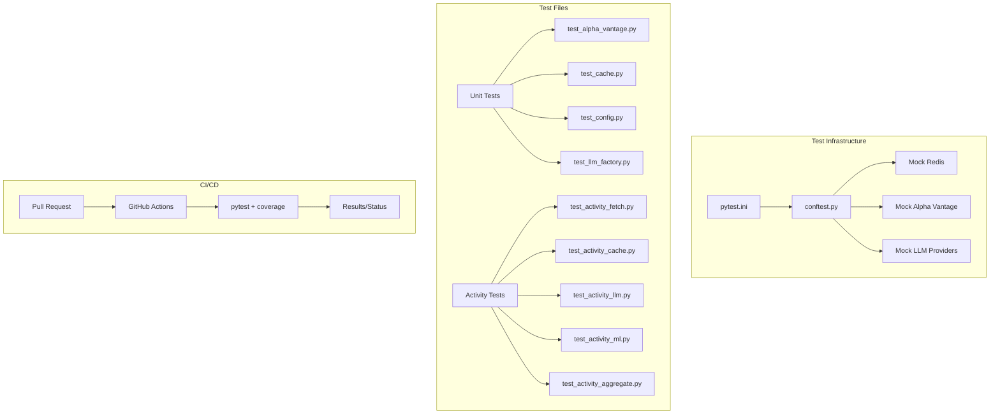

# Design Document: Functions Testing Setup

## Overview

This design establishes comprehensive testing infrastructure for the InvestingIQ Azure Functions (Python) application. The solution uses pytest as the test runner with pytest-cov for coverage reporting, implements mock utilities for Redis, HTTP APIs, and LLM providers, and sets up GitHub Actions for CI/CD with an 80% coverage threshold.

The architecture follows a simple, pragmatic approach:
- Configure pytest with pytest-asyncio for async function testing
- Create mock fixtures for external dependencies (Redis, Alpha Vantage, LLM providers)
- Write focused tests for shared utilities and activity functions
- Set up GitHub Actions workflow for automated testing on PRs

## Architecture



## Components and Interfaces

### 1. Pytest Configuration (pytest.ini)

```ini
[pytest]
testpaths = tests
python_files = test_*.py
python_classes = Test*
python_functions = test_*
asyncio_mode = auto
markers =
    unit: Unit tests
    integration: Integration tests
addopts = -v --tb=short

[coverage:run]
source = shared,activity_fetch_data,activity_cache_data,activity_llm_analysis,activity_ml_analysis,activity_aggregate
omit = 
    */tests/*
    */__pycache__/*
    */.venv/*

[coverage:report]
fail_under = 80
show_missing = true
exclude_lines =
    pragma: no cover
    if __name__ == .__main__.:
```

### 2. Conftest.py (Shared Fixtures)

```python
import pytest
from unittest.mock import MagicMock, patch
import json

# Mock Redis Client
class MockRedis:
    def __init__(self):
        self._data = {}
    
    def get(self, key):
        return self._data.get(key)
    
    def setex(self, key, ttl, value):
        self._data[key] = value
        return True
    
    def delete(self, key):
        self._data.pop(key, None)
        return True
    
    def incr(self, key):
        val = int(self._data.get(key, 0)) + 1
        self._data[key] = str(val)
        return val

@pytest.fixture
def mock_redis():
    return MockRedis()

@pytest.fixture
def mock_redis_client(mock_redis):
    with patch('shared.cache.redis.Redis') as mock:
        mock.return_value = mock_redis
        yield mock_redis

# Mock Alpha Vantage responses
@pytest.fixture
def mock_stock_data():
    return {
        "ticker": "AAPL",
        "price_history": [
            {"date": "2024-01-01", "open": 150.0, "high": 155.0, "low": 148.0, "close": 152.0, "volume": 1000000}
        ],
        "current_price": 152.0,
        "company_info": {"name": "Apple Inc.", "sector": "Technology"}
    }

@pytest.fixture
def mock_llm_response():
    return {
        "success": True,
        "analysis": {
            "ticker": "AAPL",
            "technical": {"trend": "bullish"},
            "fundamental": {"rating": "buy"},
            "sentiment": {"score": 0.7},
            "prediction": {"target": 160.0},
            "recommendation": "Buy"
        }
    }
```

### 3. Mock Alpha Vantage (tests/mocks/alpha_vantage_mocks.py)

```python
import responses

MOCK_DAILY_RESPONSE = {
    "Meta Data": {"2. Symbol": "AAPL"},
    "Time Series (Daily)": {
        "2024-01-02": {"1. open": "151.0", "2. high": "156.0", "3. low": "149.0", "4. close": "153.0", "5. volume": "1100000"},
        "2024-01-01": {"1. open": "150.0", "2. high": "155.0", "3. low": "148.0", "4. close": "152.0", "5. volume": "1000000"}
    }
}

MOCK_OVERVIEW_RESPONSE = {
    "Symbol": "AAPL",
    "Name": "Apple Inc.",
    "Sector": "Technology",
    "Industry": "Consumer Electronics",
    "MarketCapitalization": "3000000000000",
    "PERatio": "28.5"
}

MOCK_RATE_LIMIT_RESPONSE = {
    "Note": "Thank you for using Alpha Vantage! Our standard API rate limit is 25 requests per day."
}

def setup_alpha_vantage_mocks():
    responses.add(
        responses.GET,
        "https://www.alphavantage.co/query",
        json=MOCK_DAILY_RESPONSE,
        status=200
    )
```

### 4. Mock LLM Providers (tests/mocks/llm_mocks.py)

```python
from unittest.mock import MagicMock

def create_mock_openai_client():
    mock_client = MagicMock()
    mock_response = MagicMock()
    mock_response.choices = [MagicMock()]
    mock_response.choices[0].message.content = '{"technical": {}, "fundamental": {}, "sentiment": {}, "prediction": {}, "recommendation": "Hold"}'
    mock_response.choices[0].message.tool_calls = None
    mock_client.chat.completions.create.return_value = mock_response
    return mock_client

def create_mock_anthropic_client():
    mock_client = MagicMock()
    mock_response = MagicMock()
    mock_response.stop_reason = "end_turn"
    mock_response.content = [MagicMock(text='{"technical": {}, "recommendation": "Hold"}')]
    mock_client.messages.create.return_value = mock_response
    return mock_client
```

### 5. GitHub Actions Workflow (.github/workflows/functions-tests.yml)

```yaml
name: Functions Tests

on:
  pull_request:
    branches: [main, master]
    paths:
      - 'functions/**'
      - '.github/workflows/functions-tests.yml'

jobs:
  test:
    runs-on: ubuntu-latest
    defaults:
      run:
        working-directory: functions

    steps:
      - uses: actions/checkout@v4

      - name: Setup Python
        uses: actions/setup-python@v5
        with:
          python-version: '3.11'
          cache: 'pip'
          cache-dependency-path: functions/requirements.txt

      - name: Install dependencies
        run: |
          pip install -r requirements.txt
          pip install pytest pytest-cov pytest-asyncio responses hypothesis

      - name: Run tests with coverage
        run: pytest --cov --cov-report=xml --cov-report=html --cov-fail-under=80

      - name: Upload coverage
        uses: actions/upload-artifact@v4
        if: always()
        with:
          name: coverage-report
          path: functions/htmlcov/
```

## Data Models

### Test File Structure

```
functions/
├── tests/
│   ├── __init__.py
│   ├── conftest.py              # Shared fixtures
│   ├── mocks/
│   │   ├── __init__.py
│   │   ├── alpha_vantage_mocks.py
│   │   ├── llm_mocks.py
│   │   └── redis_mocks.py
│   ├── unit/
│   │   ├── __init__.py
│   │   ├── test_alpha_vantage.py
│   │   ├── test_cache.py
│   │   ├── test_config.py
│   │   └── test_llm_factory.py
│   └── activities/
│       ├── __init__.py
│       ├── test_activity_fetch.py
│       ├── test_activity_cache.py
│       ├── test_activity_llm.py
│       ├── test_activity_ml.py
│       └── test_activity_aggregate.py
├── pytest.ini
└── requirements.txt
```

## Correctness Properties

*A property is a characteristic or behavior that should hold true across all valid executions of a system—essentially, a formal statement about what the system should do. Properties serve as the bridge between human-readable specifications and machine-verifiable correctness guarantees.*

Based on the prework analysis, the following properties are testable:

**Property 1: Mock Redis Round-Trip**
*For any* key-value pair where key is a non-empty string and value is JSON-serializable, setting the value in mock Redis and then getting it SHALL return the original value.
**Validates: Requirements 3.1, 3.2**

**Property 2: API Key Rotation Distribution**
*For any* list of N API keys (N > 1), after N consecutive calls to get_api_key(), each key SHALL have been returned exactly once (round-robin distribution).
**Validates: Requirements 6.1**

**Property 3: StockCache Round-Trip**
*For any* ticker string and valid stock data dictionary, calling set_prices then get_prices SHALL return equivalent data.
**Validates: Requirements 6.2**

**Property 4: LLM Factory Provider Creation**
*For any* supported provider name from the factory's provider list, calling create() SHALL return an instance of the corresponding provider class.
**Validates: Requirements 6.4**

**Property 5: Safe Conversion Functions**
*For any* valid numeric string (integer or float format), safe_float SHALL return the correct float value. *For any* invalid input (None, empty string, "-", non-numeric), safe_float SHALL return None.
**Validates: Requirements 6.5**

## Error Handling

### Test Failures
- pytest provides detailed error messages with expected vs actual values
- Stack traces point to exact line numbers in test files
- CI pipeline marks PR check as failed, blocking merge

### Mock Failures
- Clear error messages when mocks are not properly configured
- Fixtures ensure consistent mock state across tests

### CI Pipeline Failures
- GitHub Actions provides logs for debugging
- Coverage artifacts uploaded even on failure for analysis
- 80% threshold enforced via pytest-cov --cov-fail-under

## Testing Strategy

### Unit Tests
Unit tests verify specific examples and edge cases:

1. **Shared Utility Tests**: Test individual functions in isolation
2. **Activity Tests**: Test activity functions with mocked dependencies
3. **Error Handling Tests**: Verify proper error responses

### Property-Based Tests
Property tests verify universal properties across inputs. Using `hypothesis` library:

- **Minimum 100 iterations** per property test
- Each test tagged with: **Feature: functions-testing-setup, Property N: {property_text}**

### Test Configuration
- pytest configured with pytest-asyncio for async support
- responses library for HTTP mocking
- hypothesis for property-based testing

### Coverage Goals
- 80% minimum coverage threshold enforced
- Focus on critical paths: API client, caching, LLM integration
- Activity functions tested with mocked dependencies
