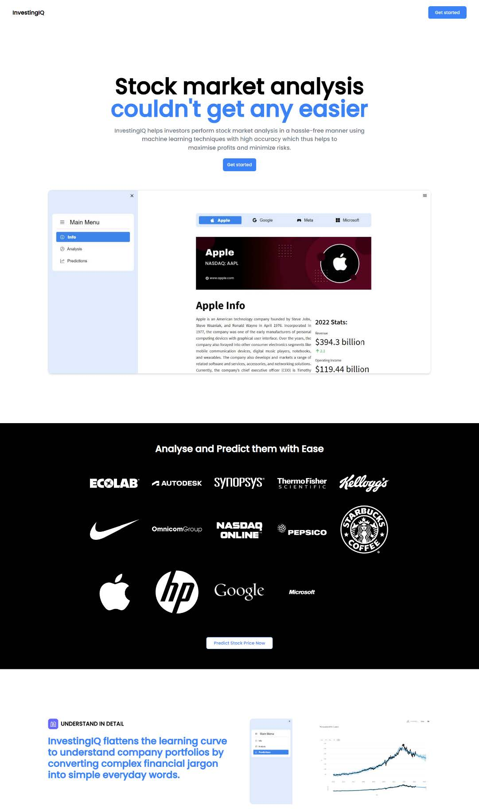
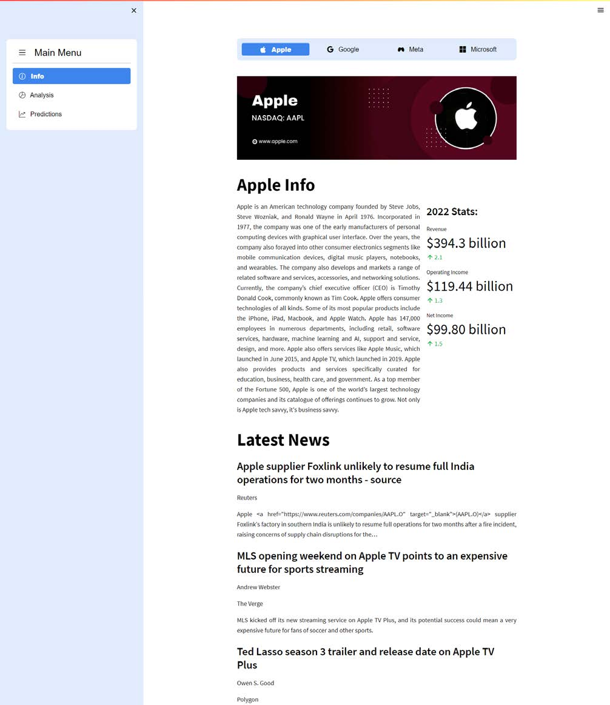
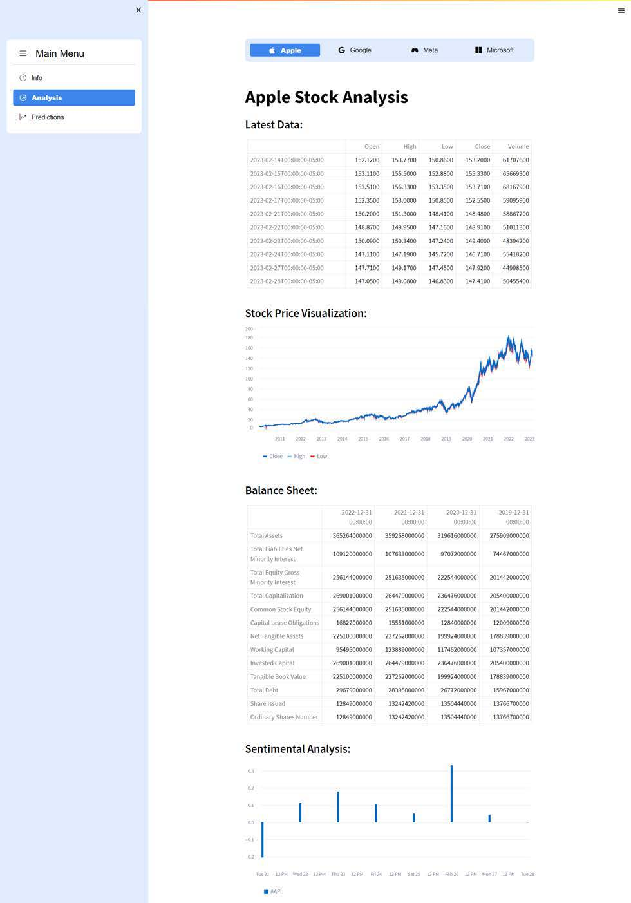
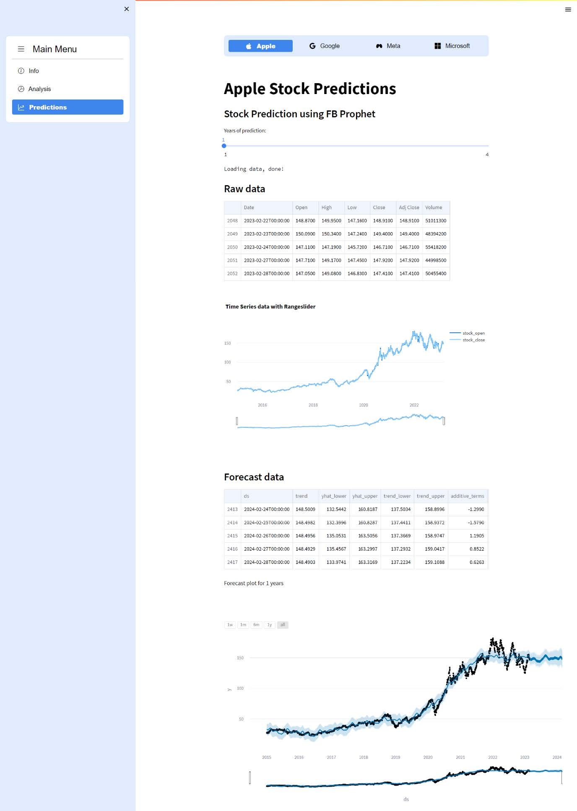
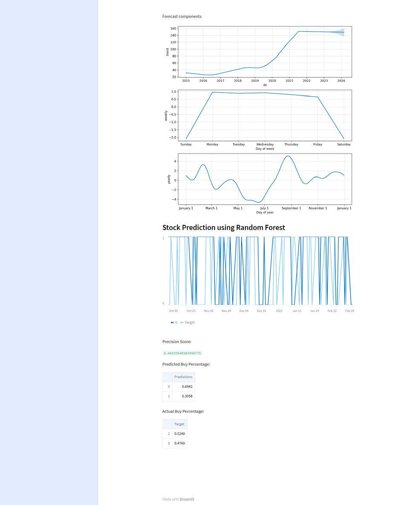

<!-- Improved compatibility of back to top link: See: https://github.com/othneildrew/Best-README-Template/pull/73 -->

<!--
*** Thanks for checking out the Best-README-Template. If you have a suggestion
*** that would make this better, please fork the repo and create a pull request
*** or simply open an issue with the tag "enhancement".
*** Don't forget to give the project a star!
*** Thanks again! Now go create something AMAZING! :D
-->

<!-- PROJECT SHIELDS -->
<!--
*** I'm using markdown "reference style" links for readability.
*** Reference links are enclosed in brackets [ ] instead of parentheses ( ).
*** See the bottom of this document for the declaration of the reference variables
*** for contributors-url, forks-url, etc. This is an optional, concise syntax you may use.
*** https://www.markdownguide.org/basic-syntax/#reference-style-links
-->
[![Contributors][contributors-shield]][contributors-url]
[![Forks][forks-shield]][forks-url]
[![Stargazers][stars-shield]][stars-url]
[![Issues][issues-shield]][issues-url]
[![MIT License][license-shield]][license-url]
[![LinkedIn][linkedin-shield]][linkedin-url]

<!-- PROJECT LOGO -->
 

  

<h3 align="center">Investingiq – Algorithmic Trading Dashboard Powered By AI & ML Built Using ReactJS & Python</h3>

  

InvestingIQ is a user-friendly online platform built with ReactJS, Python, and Streamlit, designed to assist retail investors in making informed decisions in the stock market. It offers comprehensive stock information, including current and historical stock prices, company news, and management insights. The platform also features two machine learning models, Facebook's Prophet and Random Forest, for predicting future stock prices. Additionally, it provides sentiment analysis to gauge public confidence in the company. With these powerful tools and data-driven insights, InvestingIQ simplifies the investment process, allowing investors to make hassle-free decisions with confidence.
     
    <a href="https://github.com/knowgaurav/investingIQ-main">View Demo</a>
    ·
    <a href="https://github.com/knowgaurav/investingIQ-main/issues">Report Bug</a>
    ·
    <a href="https://github.com/knowgaurav/investingIQ-main/issues">Request Feature</a>
  

<!-- TABLE OF CONTENTS -->

  
Table of Contents

  <ol>
    <li>
      <a href="#about-the-project">About The Project</a>
      <ul>
        <li><a href="#built-with">Built With</a></li>
      </ul>
    </li>
    <li><a href="#usage">About</a></li>
    <li><a href="#license">License</a></li>
    <li><a href="#contact">Contact</a></li>
    <li><a href="#acknowledgments">Acknowledgments</a></li>
  </ol>

<!-- ABOUT THE PROJECT -->
## About The Project

  

  

  

  

  

(<a href="#readme-top">back to top</a>)

### Built With

* 
* 
* 
* 

(<a href="#readme-top">back to top</a>)

<!-- GETTING STARTED -->
## Details

**InvestingIQ: Stock Market Analysis and Prediction Platform**

Welcome to the InvestingIQ GitHub repository! This project is a cutting-edge online platform designed to empower retail investors with comprehensive information and powerful tools for stock market analysis. Built using ReactJS, Python, and Streamlit, InvestingIQ serves as a one-stop destination for investors to make informed decisions with ease.

**Key Features:**

1. **Comprehensive Stock Information:** Investors can access a wealth of information about various stocks in a user-friendly format. The platform provides current and historical stock price data, latest news updates about the company, and other relevant details to keep investors well-informed.

2. **Quantitative Analysis Made Easy:** With InvestingIQ, investors can perform quantitative analysis effortlessly. The platform offers various metrics, including Profitability, Liquidity, and Asset Turnover, formulated from the latest quarter balance sheet of each company. These metrics provide valuable insights into the company's financial performance.

3. **Machine Learning Models:** InvestingIQ incorporates two powerful machine learning models – Facebook's Prophet and Random Forest. These models independently predict the future stock prices of companies, aiding investors in understanding potential stock performance.

4. **Company Management Insights:** Each stock profile includes a dedicated section that sheds light on how the company is managed by the current leadership. This feature helps investors evaluate the overall competence and strategy of the company's management.

5. **Sentiment Analysis:** The platform utilizes a sentiment analysis model to assess the company's perception on various social network sites and news outlets. This analysis provides an understanding of the general public's confidence in the company.

**Benefits:**

- **Data-Driven Decision Making:** InvestingIQ empowers investors to make data-driven decisions by providing a wealth of financial and sentiment data for each company. This enables investors to evaluate investment opportunities with greater confidence.

- **Predictive Insights:** The inclusion of machine learning models enhances the platform's value by providing future stock price predictions. Investors can factor in these predictions while formulating their investment strategies.

- **User-Friendly Interface:** The user interface of InvestingIQ is designed to be intuitive and easy to navigate. Investors, regardless of their expertise level, can seamlessly access and comprehend the information provided.

- **Hassle-Free Investing:** By consolidating comprehensive information and analysis tools, InvestingIQ simplifies the investment process for retail investors. This one-stop platform streamlines the research and decision-making process.

Whether you are a seasoned investor or a newcomer to the stock market, InvestingIQ offers valuable insights and predictions to support your investment journey. The combination of ReactJS, Python, and Streamlit ensures a seamless and interactive experience, making InvestingIQ the go-to platform for retail investors seeking to navigate the stock market with confidence.

(<a href="#readme-top">back to top</a>)

<!-- LICENSE -->
## License

Distributed under the MIT License. See `LICENSE.txt` for more information.

(<a href="#readme-top">back to top</a>)

<!-- CONTACT -->
## Contact

Gaurav Singh - [@knowgaurav01](https://twitter.com/knowgaurav01) - hello@sgaurav.me

Project Link: [https://github.com/knowgaurav/investingIQ-main](https://github.com/github_username/interview-prep)

(<a href="#readme-top">back to top</a>)

<!-- MARKDOWN LINKS & IMAGES -->
<!-- https://www.markdownguide.org/basic-syntax/#reference-style-links -->
[contributors-shield]: https://img.shields.io/github/contributors/knowgaurav/investingIQ-main.svg?style=for-the-badge
[contributors-url]: https://github.com/knowgaurav/investingIQ-main/graphs/contributors
[forks-shield]: https://img.shields.io/github/forks/knowgaurav/investingIQ-main.svg?style=for-the-badge
[forks-url]: https://github.com/knowgaurav/investingIQ-main/network/members
[stars-shield]: https://img.shields.io/github/stars/knowgaurav/investingIQ-main.svg?style=for-the-badge
[stars-url]: https://github.com/knowgaurav/investingIQ-main/stargazers
[issues-shield]: https://img.shields.io/github/issues/knowgaurav/investingIQ-main.svg?style=for-the-badge
[issues-url]: https://github.com/knowgaurav/investingIQ-main/issues
[license-shield]: https://img.shields.io/github/license/knowgaurav/investingIQ-main.svg?style=for-the-badge
[license-url]: https://github.com/knowgaurav/investingIQ-main/blob/master/LICENSE.txt
[linkedin-shield]: https://img.shields.io/badge/-LinkedIn-black.svg?style=for-the-badge&logo=linkedin&colorB=555
[linkedin-url]: https://in.linkedin.com/in/knowgaurav
[product-screenshot]: images/screenshot.png
[Next.js]: https://img.shields.io/badge/next.js-000000?style=for-the-badge&logo=nextdotjs&logoColor=white
[Next-url]: https://nextjs.org/
[React.js]: https://img.shields.io/badge/React-20232A?style=for-the-badge&logo=react&logoColor=61DAFB
[React-url]: https://reactjs.org/
[Vue.js]: https://img.shields.io/badge/Vue.js-35495E?style=for-the-badge&logo=vuedotjs&logoColor=4FC08D
[Vue-url]: https://vuejs.org/
[Angular.io]: https://img.shields.io/badge/Angular-DD0031?style=for-the-badge&logo=angular&logoColor=white
[Angular-url]: https://angular.io/
[Svelte.dev]: https://img.shields.io/badge/Svelte-4A4A55?style=for-the-badge&logo=svelte&logoColor=FF3E00
[Svelte-url]: https://svelte.dev/
[Laravel.com]: https://img.shields.io/badge/Laravel-FF2D20?style=for-the-badge&logo=laravel&logoColor=white
[Laravel-url]: https://laravel.com
[Bootstrap.com]: https://img.shields.io/badge/Bootstrap-563D7C?style=for-the-badge&logo=bootstrap&logoColor=white
[Bootstrap-url]: https://getbootstrap.com
[JQuery.com]: https://img.shields.io/badge/jQuery-0769AD?style=for-the-badge&logo=jquery&logoColor=white
[JQuery-url]: https://jquery.com 
[C++]: https://img.shields.io/badge/c++-%2300599C.svg?style=for-the-badge&logo=c%2B%2B&logoColor=white
[C++-url]: https://isocpp.org/
[Codeforces]: https://img.shields.io/badge/Codeforces-445f9d?style=for-the-badge&logo=Codeforces&logoColor=white
[Codeforces-url]: https://codeforces.com/
[LeetCode]: https://img.shields.io/badge/LeetCode-000000?style=for-the-badge&logo=LeetCode&logoColor=#d16c06
[LeetCode-url]: https://leetcode.com